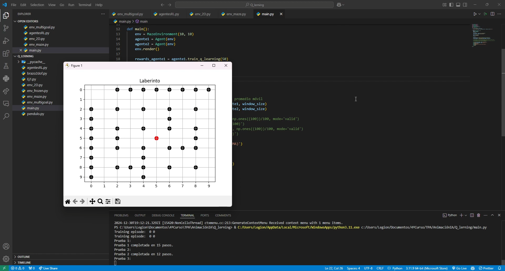

# 🤖 Entrenamiento de Agentes con Q-Learning y SARSA

 

## 📌 Descripción  

Este proyecto compara dos algoritmos clásicos de **aprendizaje por refuerzo**: **Q-Learning** y **SARSA**.  
El objetivo es entrenar agentes para adaptarse y aprender en diferentes entornos, evaluando sus comportamientos y rendimiento.  

El proyecto incluye:  
- Implementaciones propias de **Q-Learning** y **SARSA**.  
- Varios entornos de prueba (simulados).  
- Sistema de evaluación para comparar resultados.  

---

## 🚀 Tecnologías utilizadas  

- **Lenguaje:** Python  
- **Librerías:** NumPy, Matplotlib.
- **Algoritmos:**  
  - Q-Learning  
  - SARSA  

---

## 🌐 Environments utilizados  

El proyecto incluye entrenamiento en distintos entornos de Gym/OpenAI:  

- `FrozenLake-v1`  
- `Maze`  
- `Maze-Multigoal`  

---

## 🧠 Algoritmos implementados  

1. **Q-Learning**  
   - Algoritmo off-policy de aprendizaje por refuerzo.  
   - Actualiza la función de valor Q considerando la mejor acción futura estimada.  

2. **SARSA (State-Action-Reward-State-Action)**  
   - Algoritmo on-policy.  
   - Actualiza Q considerando la acción real elegida en el siguiente estado, adaptándose a la política exploratoria.  

---

## 🖼️ Ejemplo visual del entrenamiento  

- Ejemplo de entorno y agente en acción:  
    

---

## 👤 Autor  

- [Enrique Morcillo Martínez](https://github.com/kitex03)  

---

## ✨ Aprendizajes  

- Compresión de los algoritmos de **Q-Learning** y **SARSA**.  
- Comprensión profunda de la diferencia entre **on-policy** y **off-policy**.  
- Análisis comparativo del rendimiento de los agentes según el algoritmo y entorno.  
- Visualización de aprendizaje mediante gráficas y simulaciones.  

